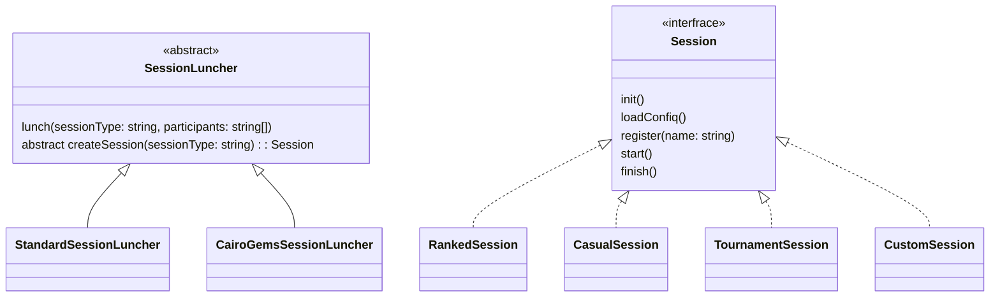

# Game Session Luncher
This design based on these [requirements](../assets/requirements.jpg).

## OOD

```mermaid
classDiagram

SessionLuncher <|-- StandardSessionLuncher
SessionLuncher <|-- CairoGemsSessionLuncher

class SessionLuncher {
  <<abstract>>
  lunch(sessionType: string, participants: string[])
  abstract createSession(sessionType: string): Session
}

%% ---

Session <|.. RankedSession
Session <|.. CasualSession
Session <|.. TournamentSession
Session <|.. CustomSession

class Session {
  <<interfrace>>

  init()
  loadConfiq()
  register(name: string)
  start()
  finish()
}
```