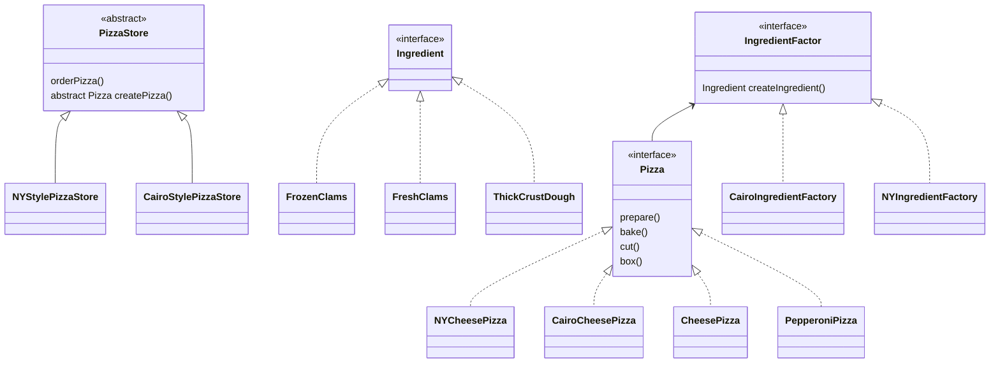

```mermaid
classDiagram
IngredientFactor <-- Pizza
Pizza <|.. NYCheesePizza
Pizza <|.. CairoCheesePizza
Pizza <|.. CheesePizza
Pizza <|.. PepperoniPizza

class Pizza {
  <<interface>>
  prepare()
  bake()
  cut()
  box()
}

%% ---

PizzaStore <|-- NYStylePizzaStore 
PizzaStore <|-- CairoStylePizzaStore

class PizzaStore {
  <<abstract>>

  orderPizza()
  abstract Pizza createPizza()
}

%% ---

Ingredient <|.. FrozenClams
Ingredient <|.. FreshClams
Ingredient <|.. ThickCrustDough

class Ingredient {
  <<interface>>
}
%% ---
IngredientFactor <|.. CairoIngredientFactory
IngredientFactor <|.. NYIngredientFactory

class IngredientFactor{
  <<interface>>

  Ingredient createIngredient()
}
```