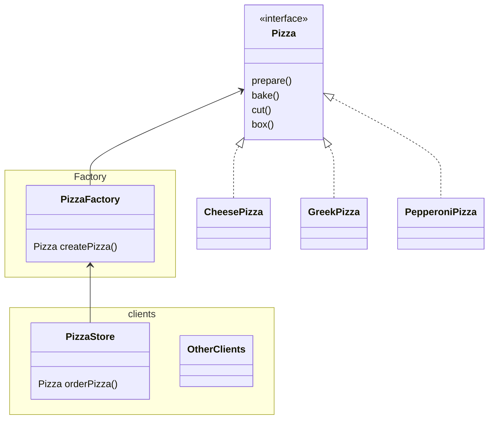

```mermaid
classDiagram

Pizza <|.. CheesePizza
Pizza <|.. GreekPizza
Pizza <|.. PepperoniPizza

class Pizza {
  <<interface>>
  prepare()
  bake()
  cut()
  box()
}

class PizzaFactory {
  Pizza createPizza()
}
namespace Factory {
  class PizzaFactory
}
Pizza <-- PizzaFactory

class PizzaStore {
  Pizza orderPizza()
}
namespace clients {
  class PizzaStore
  class OtherClients
}

PizzaFactory <-- PizzaStore

```