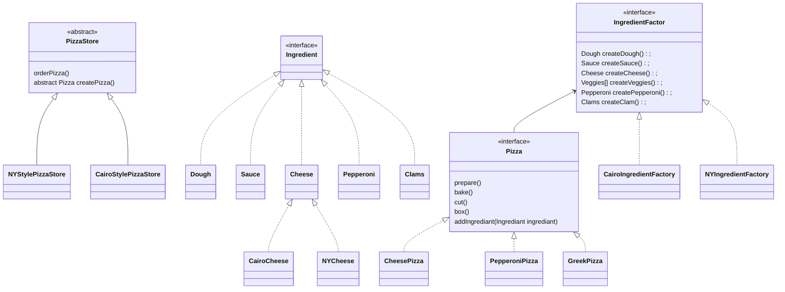

```mermaid
classDiagram
IngredientFactor <-- Pizza
Pizza <|.. CheesePizza
Pizza <|.. PepperoniPizza
Pizza <|.. GreekPizza

class Pizza {
  <<interface>>
  prepare()
  bake()
  cut()
  box()
  addIngrediant(Ingrediant ingrediant)
}

%% ---

PizzaStore <|-- NYStylePizzaStore 
PizzaStore <|-- CairoStylePizzaStore

class PizzaStore {
  <<abstract>>

  orderPizza()
  abstract Pizza createPizza()
}

%% ---

Ingredient <|.. Dough
Ingredient <|.. Sauce
Ingredient <|.. Cheese
Ingredient <|.. Pepperoni
Ingredient <|.. Clams

Cheese <|.. CairoCheese
Cheese <|.. NYCheese

class Ingredient {
  <<interface>>
}
%% ---
IngredientFactor <|.. CairoIngredientFactory
IngredientFactor <|.. NYIngredientFactory

class IngredientFactor{
  <<interface>>
  Dough createDough();
  Sauce createSauce();
  Cheese createCheese();
  Veggies[] createVeggies();
  Pepperoni createPepperoni();
  Clams createClam();
}
```