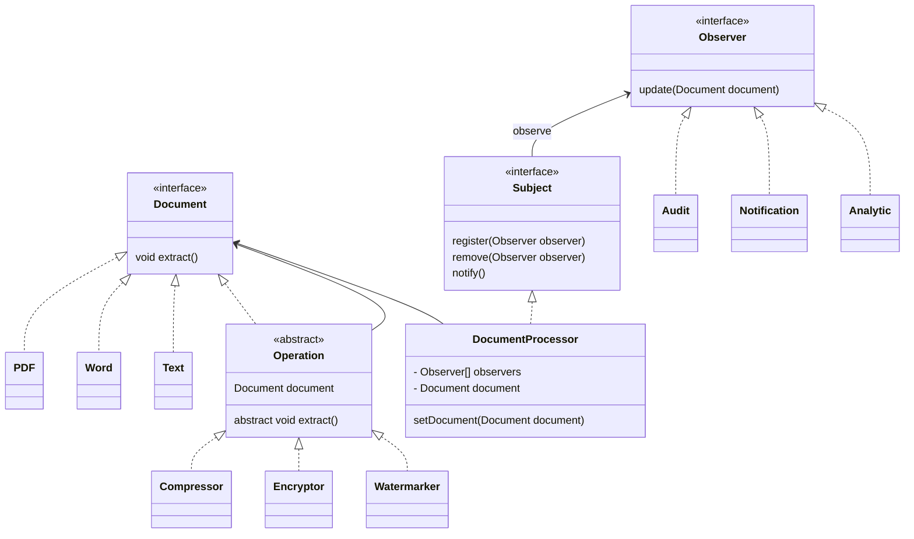

```mermaid
classDiagram  

Document <|.. PDF
Document <|.. Word
Document <|.. Text
Document <|.. Operation

class Document {
  <<interface>>
  void extract()
}
%% -------------------------
Document <-- Operation
Operation <|.. Compressor
Operation <|.. Encryptor
Operation <|.. Watermarker

class Operation {
  <<abstract>>
  Document document
  abstract void extract()
}

%% -------------------------
Document <-- DocumentProcessor 
Subject <|.. DocumentProcessor

class Subject {
  <<interface>>

  register(Observer observer)
  remove(Observer observer)
  notify()
}

class DocumentProcessor {
  - Observer[] observers
  - Document document

  setDocument(Document document)
}
%% -------------------------

Observer <-- Subject : observe

Observer <|.. Audit
Observer <|.. Notification
Observer <|.. Analytic

class Observer {
  <<interface>>
  update(Document document)
}
```